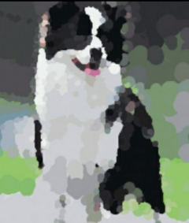

<p align="center">
  <a href="https://github.com/googege/collie">
    
  </a>
</p>

<p align="center">
    Picture processing tools like compressing pictures, adding watermarks, etc ,it support batch processing.
</p>

<p align="center">
    <a href="#">Documentation</a> | 
    <a href="#">中文介绍</a> 
</p>

<p align="center">
    <a href="https://travis-ci.com/googege/collie.svg?branch=master">
    
    </a>
  <a href="https://goreportcard.com/report/github.com/googege/collie"></a>
  <a href="https://golang.org"></a>
  <a href="https://pkg.go.dev/search?q=googege" rel="nofollow"></a>
  <a href="https://raw.githubusercontent.com/googege/collie/master/LICENSE" rel="nofollow"></a>
</p> 

<p align="center">
    Learn more: <a href="https://github.com/googege" target="_blank">googege</a>
</p>

### Features
- 🚄 **Fast**: leveraging go's high concurrency capabilities, this tool has unparalleled speed.

- 🚲 **Easy**: you just need install it to the terminal and you can get started quickly.
### How to use
```bash
collie example_path -x 1000 
```


